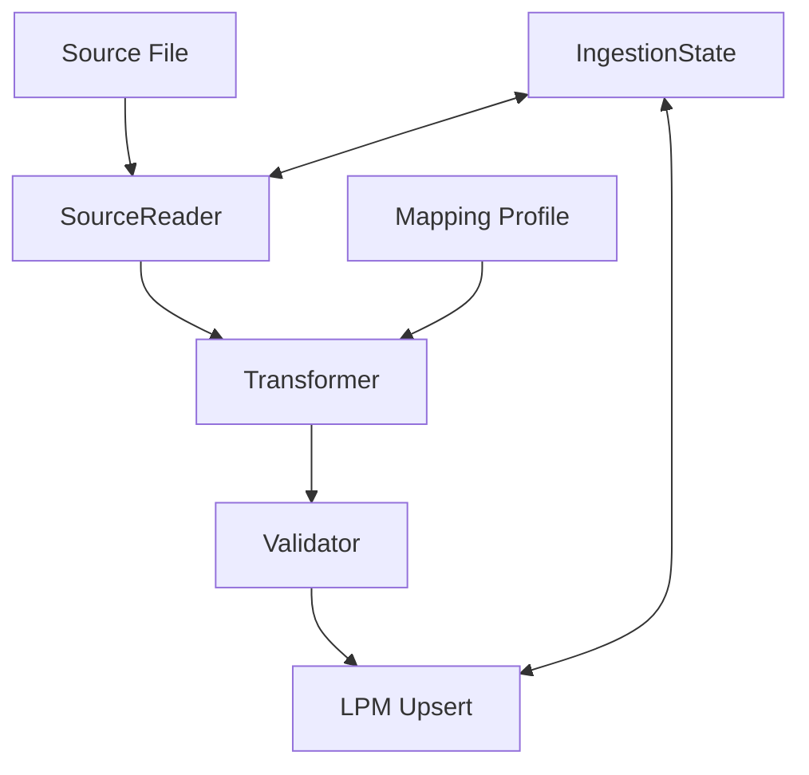

# Specifications: Bulk Ingestion Module

> Version: 0.1  
> Status: DRAFT  
> Last Updated: 2026-02-04  
> Requirements: [01-requirements.md](01-requirements.md)

---

## 1. Architecture Overview

The Bulk Ingestion Module is designed as a modular pipeline that decouples data reading, transformation, and storage. It uses a tiered state management system to ensure reliability.



## 2. Component Specifications

### 2.1 BulkIngestionPipeline
The main orchestrator class.
- `run(source_path: str, profile_id: str)`: Executes the full pipeline.
- `resume(job_id: str)`: Resumes an interrupted ingestion using `IngestionState`.

### 2.2 SourceReader (Interface)
Concrete implementations for:
- `CSVReader`: Uses `csv.DictReader` with chunking.
- `ExcelReader`: Uses `pandas` or `openpyxl`.
- `GISReader`: Uses `geopandas` to extract geometries and attributes.
- `JSONReader`: Uses `ijson` for streaming large JSON/JSONL files.

### 2.3 Transformer
Applies `MappingProfile` to raw rows.
- **Functions supported**:
    - `clean_parcel_id(val)`: Removes non-alphanumeric characters.
    - `to_decimal(val)`: Safe conversion to `Decimal`.
    - `to_date(val, format)`: Parses dates.
    - `concatenate(cols, sep)`: Merges multiple source columns.

### 2.4 IngestionState
Manages persistence of the ingestion progress.
- **Storage Strategy**:
    - `jobs/{job_id}/manifest.json`: Metadata (file size, row count, profile).
    - `jobs/{job_id}/progress.msgpack`: Binary stream of processed row IDs (highly efficient).
    - `jobs/{job_id}/errors.jsonl`: Detailed error logs for specific rows.

## 3. Data Models

### 3.1 MappingProfile (Schema)
```json
{
  "profile_name": "RealAuction-FL",
  "source_format": "csv",
  "mappings": {
    "parcel_id": {"source": "PARCEL", "transform": "clean_parcel_id"},
    "tax_amount": {"source": "FACEVALUE", "transform": "to_decimal"},
    "county": {"const": "Columbia"},
    "state": {"const": "FL"},
    "status": {"const": "auction"}
  },
  "required_fields": ["parcel_id", "county", "state"]
}
```

### 3.2 IngestionRecord
Based on `importers/csv_simple.py:create_minimal_record`, ensuring compatibility with the existing LPM schema.

## 4. State Management Mandate (Pickle/JSON/Msgpack)

| Layer | Format | Purpose |
| :--- | :--- | :--- |
| **Meta** | JSON | Job configuration, profile snapshot, overall stats. |
| **Index** | Msgpack | High-speed tracking of processed row indices/offsets. |
| **Complex** | Pickle | Serialization of `MappingProfile` objects or custom Python transforms during runtime. |

## 5. Execution Flow
1. **Init**: Calculate source file hash (SHA-256) to check for previous attempts.
2. **Load**: Load `MappingProfile`.
3. **Iterate**:
    - Read chunk from `SourceReader`.
    - Transform row using `Transformer`.
    - Validate row.
    - Write to `IngestionState` (Index layer).
    - Batch upsert to LPM every 1000 rows.
4. **Finalize**: Generate summary report.
