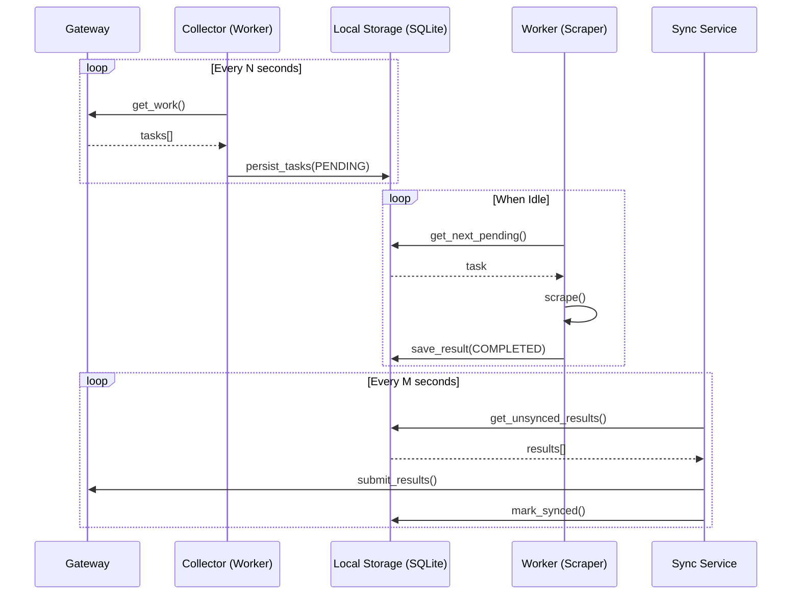

# Requirements: On-demand Mode for Tax Lien Parser

**Version:** 0.1
**Status:** REQUIREMENTS PHASE
**Last Updated:** 2026-01-30

---

## 1. Goal
Implement a mode where the parser worker fetches tasks from the **Gateway API** in real-time, but processes and stores results via the **Local Storage** layer for robustness and asynchronous delivery.

## 2. User Stories

### US-1: Reliable Task Processing
**As a** system operator  
**I want** the worker to fetch tasks from the Gateway and immediately persist them locally  
**So that** if the worker crashes during scraping, the task state is not lost.

### US-2: Asynchronous Result Delivery
**As a** system operator  
**I want** results to be stored locally first and then uploaded to the Gateway in the background  
**So that** scraping performance is not coupled to Gateway latency or availability.

### US-3: Real-time Scalability
**As a** system operator  
**I want** to spin up multiple "On-demand" workers that all report to the same Gateway  
**So that** I can scale the parsing capacity dynamically.

## 3. Functional Requirements

### FR-1: Gateway Task Collector (Puller)
- Worker MUST periodically poll the Gateway API `/internal/work` for new tasks.
- Every received task MUST be immediately persisted in the local SQLite (`localstorage`) with status `PENDING`.
- The Collector SHOULD handle Gateway rate limits and backoff headers.

### FR-2: Local Execution Loop (Worker)
- The Worker MUST fetch `PENDING` tasks from the local storage.
- It MUST mark tasks as `PROCESSING` to avoid double-processing by parallel threads (if any).
- Upon completion, results MUST be saved to the local `results` table, and the task status updated to `COMPLETED`.

### FR-3: Background Sync Service
- A background process/thread MUST monitor the local storage for `COMPLETED` but `UNSYNCED` results.
- It MUST attempt to upload results to Gateway (`/internal/results`).
- Upon successful upload, it MUST mark the local record as `SYNCED`.
- It MUST handle raw file uploads (`/internal/raw-files`) before or during result submission.

### FR-4: Heartbeat & Health
- Worker MUST continue sending heartbeats to Gateway even if the local queue is full or processing is paused.
- Heartbeat should report local queue depth (pending/completed/failed).

## 4. Interaction Model: The Decoupled Loop

## 5. Constraints
- Must use the same `LocalPersistenceManager` as the Standalone mode.
- Must handle task expiration/timeouts if the sync is delayed significantly.
