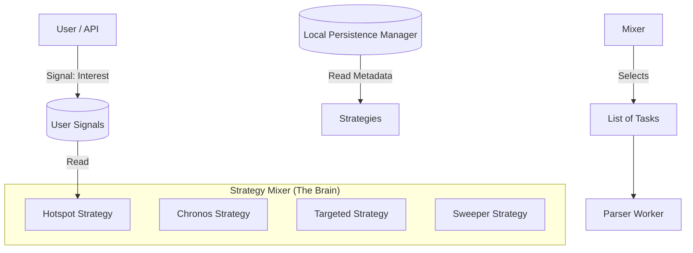

# Specifications: Traversal Strategy Module

**Version:** 0.1
**Status:** DRAFT
**Last Updated:** 2026-01-31

---

## 1. Architectural Overview

The Strategy Module sits between the **Worker** (Consumer) and **LPM** (Storage). It is a pure logic layer that converts "Business Intent" (Weights, Signals) into "Execution Units" (Tasks).



## 2. Class Design

### 2.1. Base Interfaces

```python
from abc import ABC, abstractmethod
from typing import List, Dict, Any
from dataclasses import dataclass

@dataclass
class Task:
    url: str
    payload: Dict[str, Any]
    priority: int
    strategy_source: str  # e.g., "hotspot", "chronos"
    meta: Dict[str, Any]  # Context for the parser

class BaseStrategy(ABC):
    def __init__(self, db_connection, config: Dict):
        self.db = db_connection
        self.config = config

    @property
    @abstractmethod
    def name(self) -> str:
        """Unique identifier for the strategy."""
        pass

    @abstractmethod
    def suggest_tasks(self, limit: int) -> List[Task]:
        """
        Returns a list of tasks based on the strategy's logic.
        Must respect the 'limit'.
        """
        pass

    def feedback(self, task: Task, success: bool, duration: float):
        """
        Optional: Receive feedback to adjust internal weights/logic.
        e.g., if scraping fails often, lower priority.
        """
        pass
```

### 2.2. The Mixer (Scheduler)

The `StrategyMixer` is responsible for enforcing the "Hybrid Model" weights.

```python
class StrategyMixer:
    def __init__(self, strategies: List[BaseStrategy], weights: Dict[str, float]):
        self.strategies = {s.name: s for s in strategies}
        self.weights = weights  # e.g., {'hotspot': 0.5, 'chronos': 0.1}
        # Normalization logic here...

    def get_next_tasks(self, total_limit: int) -> List[Task]:
        """
        1. Allocates quotas based on weights * total_limit.
        2. Calls suggest_tasks() for each strategy.
        3. Aggregates and returns the batch.
        """
        tasks = []
        # Logic to handle starvation and prioritization
        # ...
        return tasks
```

## 3. Data Models (LPM Requirements)

The strategies require specific tables in the Local Persistence Manager (SQLite/Postgres).

### 3.1. `tasks` (The Queue)
Used by Chronos, Targeted, and Ripple.

| Column | Type | Description |
| :--- | :--- | :--- |
| `id` | PK | Unique Task ID |
| `status` | ENUM | PENDING, PROCESSING, COMPLETED, FAILED |
| `last_scraped_at` | DATETIME | **Crucial for Chronos** |
| `priority` | INT | Base priority (0-100) |
| `county` | VARCHAR | Region grouping |
| `tags` | JSON | e.g., `{"auction": "2026-02-01", "type": "liens"}` |
| `retry_count` | INT | For error backoff |

### 3.2. `user_signals` (The Hotspot Source)
Used exclusively by **Hotspot Strategy**.

| Column | Type | Description |
| :--- | :--- | :--- |
| `id` | PK | Auto-inc |
| `region` | VARCHAR | e.g., "FL-MiamiDade" |
| `entity_id` | VARCHAR | Optional: Specific Parcel or Owner ID |
| `signal_strength` | INT | 1-100 (Heat level) |
| `created_at` | DATETIME | Signals expire after X hours |
| `user_id` | VARCHAR | Originator (for analytics) |

### 3.3. `discovery_ranges` (The Sweeper Memory)
Used by **Sweeper Strategy**.

| Column | Type | Description |
| :--- | :--- | :--- |
| `region` | VARCHAR | |
| `last_checked_id` | VARCHAR | The last ID attempted |
| `gap_start` | VARCHAR | Start of a known gap |
| `gap_end` | VARCHAR | End of a known gap |

## 4. Implementation Details

### 4.1. Chronos Query
```sql
SELECT * FROM tasks 
WHERE status != 'PROCESSING'
ORDER BY last_scraped_at ASC NULLS FIRST
LIMIT ?
```

### 4.2. Hotspot Query
```sql
SELECT t.* FROM tasks t
JOIN user_signals s ON t.county = s.region
WHERE s.created_at > NOW() - INTERVAL '1 hour'
ORDER BY s.signal_strength DESC, t.last_scraped_at ASC
LIMIT ?
```

### 4.3. Starvation Protection
The Mixer must implement a `min_guaranteed` map.
*Example:* If `Chronos` has weight 0.1 but 0 tasks were selected in the last 10 cycles (due to Hotspot taking all slots), the Mixer forces a `Chronos` batch.

## 5. Interface for API (OnDemand)

Instead of calling the parser, the API calls:
```python
def signal_interest(region: str, intensity: int = 10):
    """
    Inserts a row into `user_signals`.
    The StrategyMixer (in the background worker) will pick this up in < 500ms.
    """
    db.execute("INSERT INTO user_signals ...")
```